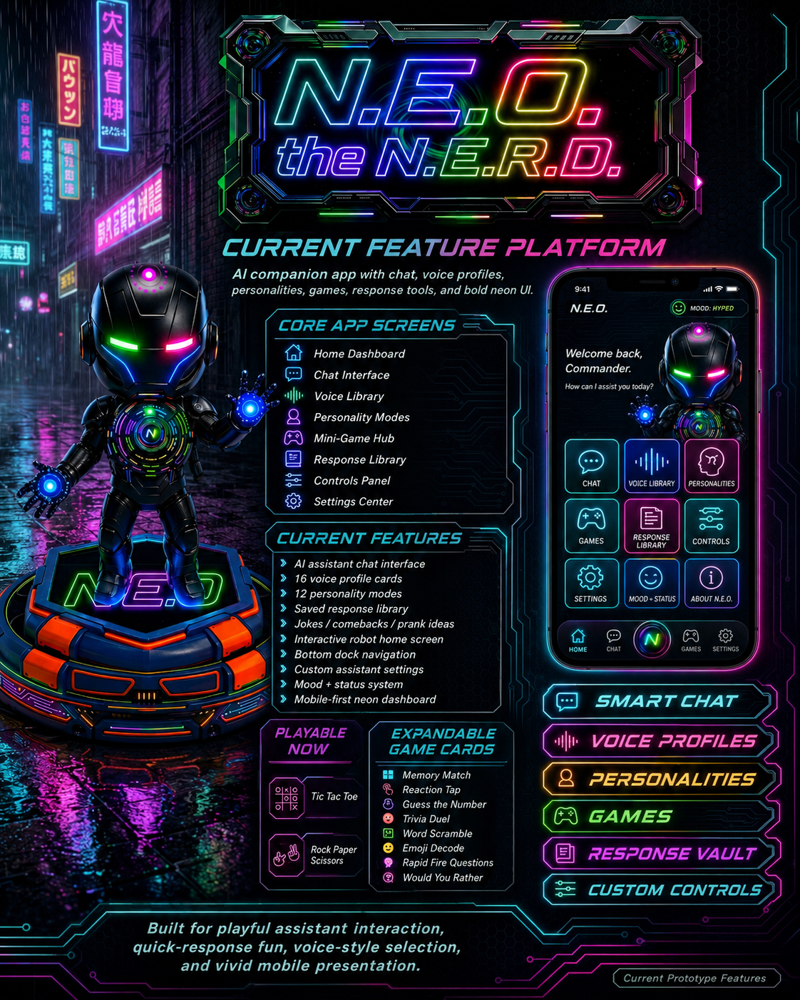
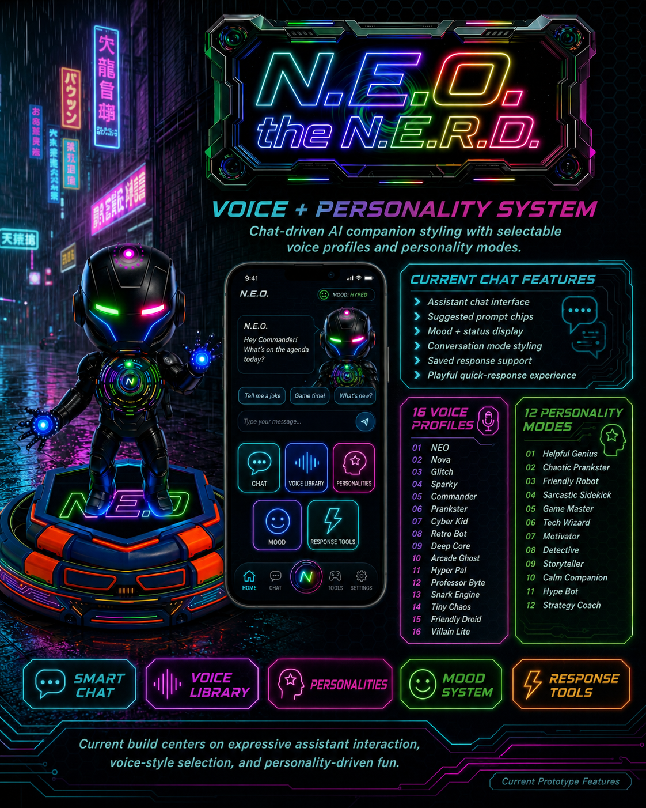
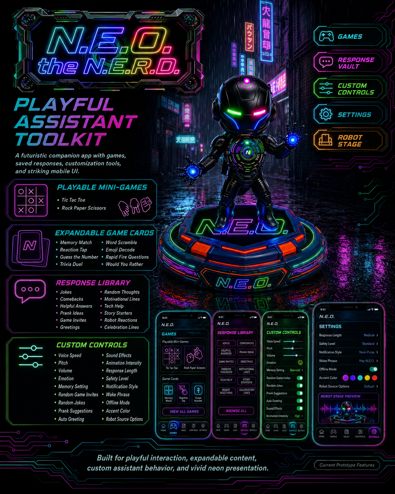

<div align="center">
  
</div>

<div align="center">

# N.E.O the N.E.R.D

<p>
  <strong>• Responsive Interactive AI Assistant</strong>
</p>

<p>
  
  
  
  
</p>

</div>

<div align="center">
  
</div>

<div align="center">
  
</div>

<div align="center">
  
</div>

## Development

This repo uses **npm** as the canonical package manager. The lockfile of record is `package-lock.json`. Alternative lockfiles (`pnpm-lock.yaml`, `yarn.lock`) are gitignored to prevent drift.

### Prerequisites
- Node.js 22+ (Capacitor 8 CLI requirement)
- npm 10+
- For Android builds: Android Studio with the Capacitor toolchain (Java 17+, Android SDK platform-tools/`adb`, Android SDK Build-Tools 35.0.0, and Android SDK Platform 36). Accept SDK licenses via `sdkmanager --licenses` before running Gradle builds.

### Install
```bash
npm install
```

### Web (Next.js)
```bash
npm run dev          # local dev server
npm run typecheck    # tsc --noEmit
npm run lint         # eslint .
npm run build        # next build + prepare Capacitor web assets in out/
npm run start        # serve the production build
```

### Android (Capacitor)
```bash
npm run build                 # produces out/ and copies assets into android/app/src/main/assets/public
npx cap sync android          # sync native plugins
npx cap open android          # open the Android project in Android Studio
```

#### Android Studio JDK setup (portable)
Gradle JDK selection is **per-machine** and must not be committed. After cloning:

1. Open **Settings → Build, Execution, Deployment → Build Tools → Gradle**.
2. Set **Gradle JDK** to `#GRADLE_LOCAL_JAVA_HOME` (preferred, reads from each machine's `~/.gradle/config.properties`) or to the IDE's bundled JDK (e.g. `jbr-21`).
3. Do **not** set `org.gradle.java.home` in `android/gradle.properties` — leaving it unset lets Gradle pick the local JDK and keeps the repo portable across machines.

Machine-specific IDE metadata (`.idea/`, `*.iml`, `local.properties`, `.gradle/`) is gitignored and must never be committed. Tracking these previously caused recurring "Invalid Gradle JDK configuration" errors on fresh clones.

### Environment
Copy `.env.example` to `.env.local` and populate any keys you need (TTS provider, etc.). Without those, the app runs against the in-browser local response engine.

#### Provider TTS for Android APKs
- Server/backend must define:
  - `OPENAI_API_KEY`
  - `OPENAI_TTS_MODEL=gpt-4o-mini-tts` (or another supported model)
- Android/client build must define:
  - `NEXT_PUBLIC_NEO_BACKEND_BASE_URL=https://your-deployed-backend-url.com`

If you build an APK without `NEXT_PUBLIC_NEO_BACKEND_BASE_URL`, the app cannot call server `/api/tts` routes from the packaged WebView and will run Android device TTS fallback mode (profiles may sound identical).

#### Provider voice diagnostics helper
Use this to verify provider-backed voice IDs differ:
```bash
node scripts/test-provider-voices.mjs
```

### Project layout
- `app/` — Next.js App Router entry
- `components/` — UI, avatar, boot, network, screens
- `lib/` — store, runtime, voice + response data, capabilities
- `android/` — Capacitor-wrapped Android project
- `public/media/neo/` — boot + avatar MP4 assets
- `scripts/prepare-capacitor.mjs` — post-build asset hand-off for Capacitor

### OmniVoice custom voice backend (optional)

OpenAI TTS remains supported. OmniVoice is an additional optional backend for custom clone/design voices.

- App routing priority: OmniVoice (if selected + configured) → OpenAI provider TTS → Android native TTS → browser speech.
- Android fallback can sound identical when device only exposes one TTS voice.
- OmniVoice must run as separate Python service (`voice-server/omnivoice/`), not inside APK.
- OmniVoice is only marked active when `GET /health` reports `status: ok`.
- If OmniVoice engine is not installed, server returns `not_configured` health and `/tts` HTTP 503.

Set:
- `NEXT_PUBLIC_OMNIVOICE_BASE_URL=https://your-omnivoice-service`
- `NEXT_PUBLIC_NEO_BACKEND_BASE_URL=https://your-next-backend` (for OpenAI `/api/tts`)

For Android builds, these `NEXT_PUBLIC_*` variables are baked into the JS bundle at build time.
